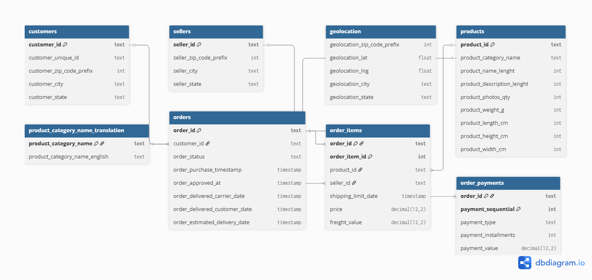

# Olist Analytics Project — Assignment 2

**Author:** Talgat Sagatov 
**Course:** Data Visualization / Database Analytics  
**Dataset:** [Olist E-Commerce Public Dataset](https://www.kaggle.com/datasets/olistbr/brazilian-ecommerce)  
**Database:** PostgreSQL (`olistdb`)

---

##  Project Overview

This project extends **Assignment 1** and demonstrates:

- Visualization of relational data from **PostgreSQL** using **Python**.
- Analytical SQL queries with **two or more JOINs**.
- Automated export to **Excel** with formatting and conditional colors.
- Interactive **Plotly** dashboard with a **time slider**.
- Live update scenario (insert → chart refresh).

The dataset describes real sales and delivery data from the **Olist Brazilian marketplace**, including orders, sellers, payments, products, and customers.

---

##  Analytical Goals

| № | Business Question | Visualization |
|---|--------------------|----------------|
| 1 | What is the **sales distribution** across product categories? |  Pie Chart |
| 2 | Which **states** in Brazil generate the highest GMV? |  Bar Chart |
| 3 | Which **sellers** contribute most to total GMV? |  Horizontal Bar |
| 4 | How does **monthly GMV** change over time? |  Line Chart |
| 5 | What is the **distribution of delivery delays**? |  Histogram |
| 6 | What is the **relationship between basket size and payment value**? |  Scatter Plot |

>  **GMV (Gross Merchandise Value)** — total value of all delivered orders (before refunds and fees).

---

##  ER-Diagram



---

##  Project Structure

```
project_root/
├── config.py                   # Database connection (SQLAlchemy)
├── analytics.py                # Main visualization script
├── main.py                     # 10 analytic queries
├── sql/                        # Queries
├── images/                     # ER-Diagram
├── datasets/                   # Olist CSV files (from Kaggle)
├── charts/                     # Output charts (PNG)
├── exports/                    # Excel reports
├── requirements.txt            # Dependencies list
├── README.md                   # Project documentation
└── .venv/                      # Virtual environment (optional)
```

---

##  Setup & Installation

### 1. Clone or copy the project
```bash
git clone https://github.com/<your-username>/olist-analytics.git
cd olist-analytics
```

### 2. Create and activate a virtual environment
```bash
python -m venv .venv
# Windows:
.venv\Scripts\activate
# macOS / Linux:
source .venv/bin/activate
```

### 3. Install dependencies
```bash
pip install -r requirements.txt
```

### 4. Configure PostgreSQL connection
Edit **config.py** or set an environment variable:
```bash
setx DB_URL "postgresql+psycopg2://postgres:<YOURPASS>@localhost:5432/olistdb"
```

---

##  How to Run

### Generate all charts + Excel report
```bash
python analytics.py --run-all
```
This command will:
- Execute all analytical SQL queries.
- Generate six PNG charts in `/charts/`.
- Create a formatted Excel report in `/exports/assignment2_olist_summary.xlsx`.
- Print a summary log to the console.

### Launch interactive dashboard
```bash
python analytics.py --interactive
```
Opens an **animated Plotly bar chart** with a **time slider** showing **monthly GMV by category**.

---

##  Example Outputs

| Visualization | Description | Example |
|----------------|-------------|----------|
| Pie Chart | GMV share by product category (Top 10 + Other) | `charts/pie_gmv_by_category.png` |
| Bar Chart | Top 10 states by GMV | `charts/bar_top_states_gmv.png` |
| Horizontal Bar | Top 15 sellers by GMV | `charts/barh_top_sellers_gmv.png` |
| Line Chart | Monthly GMV trend | `charts/line_monthly_gmv.png` |
| Histogram | Distribution of delivery delays (days) | `charts/hist_delivery_delay_days.png` |
| Scatter Plot | Items per order vs payment value | `charts/scatter_items_vs_payment.png` |

---

##  Live Update Demo (for presentation)

To demonstrate chart updates when new data appears:

1. Insert a new order, item, and payment into PostgreSQL:
   ```sql
   WITH new_order AS (
     SELECT substring(md5(random()::text),1,32) AS order_id
   ), c AS (
     SELECT customer_id FROM olist.customers LIMIT 1
   ), p AS (
     SELECT product_id FROM olist.products LIMIT 1
   ), s AS (
     SELECT seller_id FROM olist.sellers LIMIT 1
   )
   INSERT INTO olist.orders (
     order_id, customer_id, order_status,
     order_purchase_timestamp, order_approved_at,
     order_delivered_carrier_date, order_delivered_customer_date,
     order_estimated_delivery_date
   )
   SELECT n.order_id, c.customer_id, 'delivered',
          NOW() - INTERVAL '2 days', NOW() - INTERVAL '2 days',
          NOW() - INTERVAL '1 day', NOW() - INTERVAL '1 day',
          NOW() + INTERVAL '7 days'
   FROM new_order n, c, p, s
   RETURNING order_id;
   ```

2. Add one order item and payment (use returned order_id).  
3. Re-run:
   ```bash
   python analytics.py --run-all
   ```
4. Observe that the GMV-related charts update (Pie, Bar, Line).

---

##  Technologies Used

| Category | Tools |
|-----------|-------|
| Database | PostgreSQL 15+ |
| ORM / SQL Engine | SQLAlchemy |
| Data Analysis | pandas |
| Visualization | matplotlib, plotly.express |
| Excel Export | openpyxl |
| Language | Python 3.10+ |

---

## License

For educational purposes only (Astana IT University, 2025).  
Dataset © Olist — [Kaggle License](https://www.kaggle.com/datasets/olistbr/brazilian-ecommerce).

---

### Author

**Талгат Сагатов**  
📧 221204@astanait.edu.kz  
🏫 Astana IT University  
